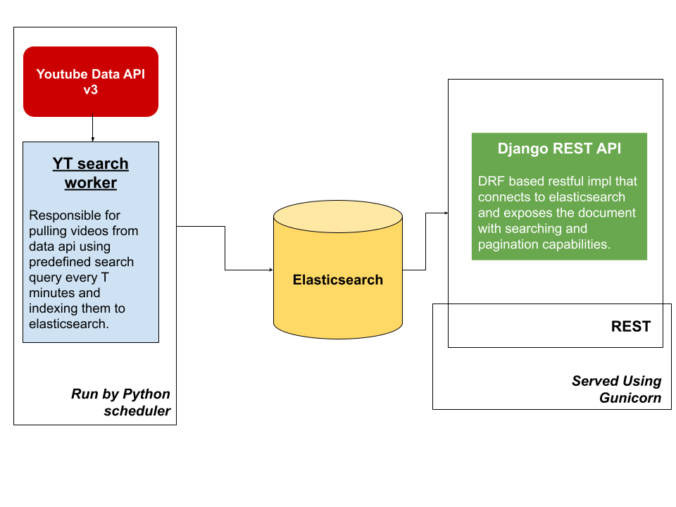

# yt-search-django

yt-search is minimal implementation of `search` functionality using **Elasticsearch** and **Youtube Data API** in Python.

## Starting the app

Create a `.env` file in root dir.

```bash
cat .sample.env > .env
```

Supply Youtube data API v3 `API_KEY` to the file.<br/>

Run `docker-compose`

```bash
docker-compose up -d
```

This will start elasticsearch instance and our django rest api.<br/>

To verify elasticsearch is ready and accepting connections, ping `localhost:9200`, if it's running and accepting requests, start the `yt-worker` using following command.

```bash
docker run -it --rm --env-file .env --network yt-search-django_default akshit8/yt-worker
```

make sure you use the network created by `docker-compose`, otherwise worker won't be able to connect to elasticsearch.

## Architecture



For better scaling and de-coupling, deploy `yt-worker` using a serverless component.

## Sample requests

- paginated list videos

```
http://localhost:8000/videos/?limit=5&offset=5
```

- search request

```
http://localhost:8000/videos/?search=shib
```

- paginated search request

```
http://localhost:8000/videos/?limit=5&search=blockhain%20crypto
```

## Note

Elasticsearch takes 15-20 seconds to start, so make sure to wait before deploying other artifacts.

## Resource

- [elasticsearch with python](http://blog.adnansiddiqi.me/getting-started-with-elasticsearch-7-in-python/)
- [elasticsearch python package](https://elasticsearch-py.readthedocs.io/en/master/api.html#elasticsearch)
- [elasticsearch mappings](https://www.elastic.co/guide/en/elasticsearch/reference/current/mapping-types.html)
- [elasticsearch and drf](https://django-elasticsearch-dsl-drf.readthedocs.io/en/latest/advanced_usage_examples.html#pagination)
- [scheduler in python](https://stackoverflow.com/questions/474528/what-is-the-best-way-to-repeatedly-execute-a-function-every-x-seconds)
- [healthcheck in compose](https://stackoverflow.com/questions/31746182/docker-compose-wait-for-container-x-before-starting-y)
- [advance depends_on docker](https://stackoverflow.com/questions/52699899/depends-on-doesnt-wait-for-another-service-in-docker-compose-1-22-0)

## Author

**Akshit Sadana <akshitsadana@gmail.com>**

- Github: [@Akshit8](https://github.com/Akshit8)
- LinkedIn: [@akshitsadana](https://www.linkedin.com/in/akshit-sadana-b051ab121/)
